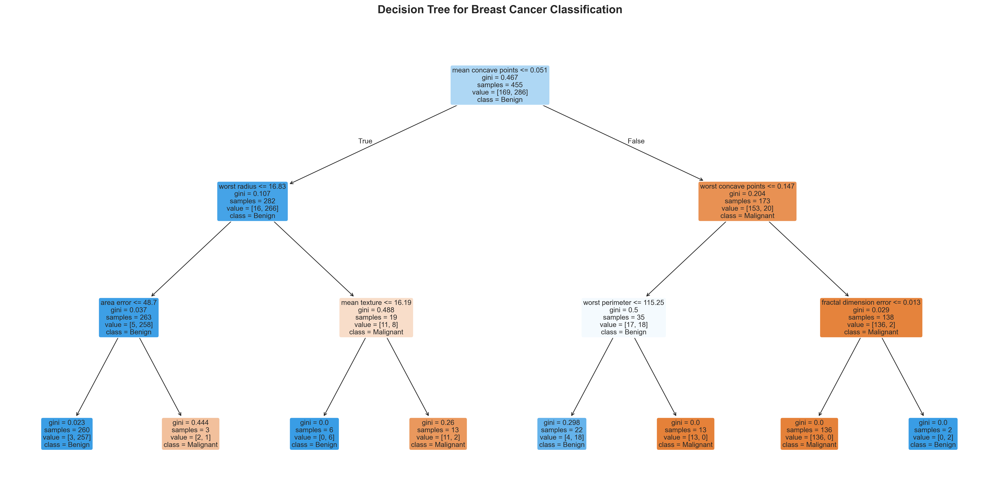
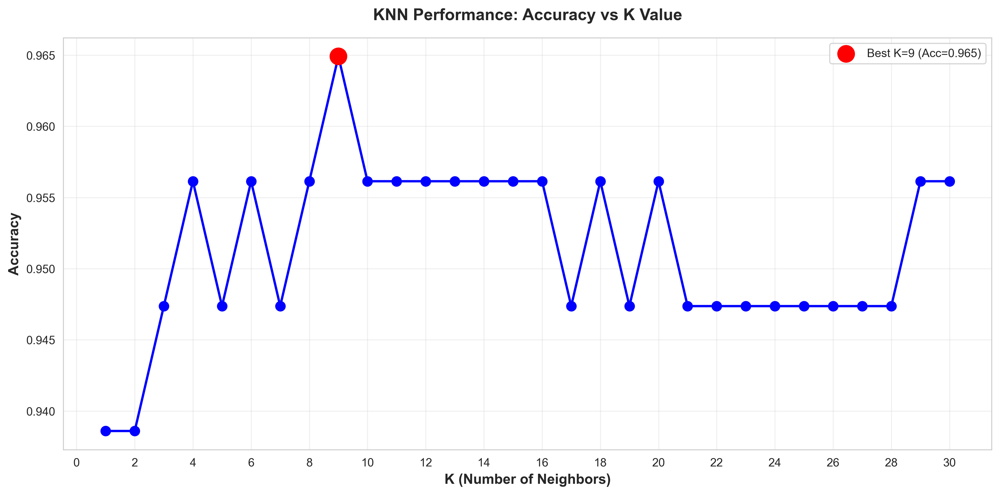
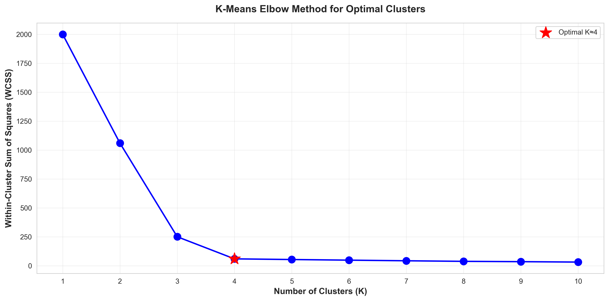
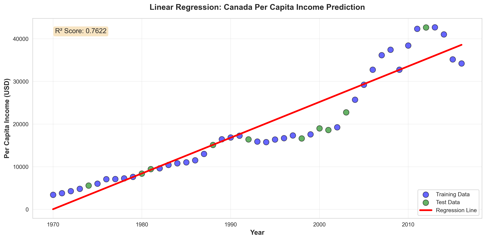
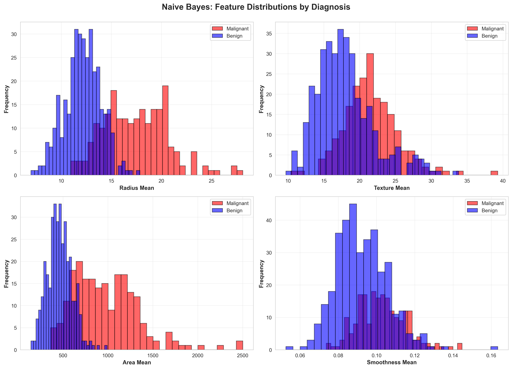

# Machine Learning Implementation Tasks

## 📋 Table of Contents
- [Overview](#overview)
- [Tasks Completed](#tasks-completed)
- [Technologies Used](#technologies-used)
- [Installation](#installation)
- [Performance Summary](#performance-summary)

---

## 🎯 Overview

A comprehensive collection of ML implementations covering supervised learning, unsupervised learning, and dimensionality reduction techniques. Built with Python, scikit-learn, and modern data science libraries.

**Highlights:**
- 5 Core ML algorithms implemented from scratch
- Real-world datasets (Medical, Social Media, Financial)
- Advanced techniques: PCA dimensionality reduction, NLP
- Complete model evaluation and visualization

---

## ✅ Tasks Completed

### Task 1: Decision Tree Classifier
**Goal:** Breast cancer classification (Malignant vs Benign)

**What I Built:**
- Binary classification model using scikit-learn Decision Tree
- Feature correlation analysis and importance ranking
- Stratified K-Fold cross-validation
- Confusion matrix and performance metrics visualization

**Results:** High accuracy with interpretable decision rules



*Hierarchical decision tree showing classification rules with Gini impurity. Color intensity indicates class confidence (blue=malignant, orange=benign).*

---

### Task 2: K-Nearest Neighbors (KNN)
**Goal:** Predict diabetes outcomes from medical data

**What I Built:**
- KNN classifier with feature scaling
- K-value optimization through experimentation
- Standardization for improved performance
- Multi-feature analysis (glucose, BMI, age, blood pressure)

**Results:** Optimal K-value identified for maximum accuracy



*K-value vs accuracy curve. Red marker shows optimal K that balances underfitting and overfitting.*

---

### Task 3: K-Means Clustering
**Goal:** Segment social media posts by engagement patterns

**What I Built:**
- Unsupervised clustering on Facebook Live dataset
- Elbow method for optimal cluster selection
- Feature engineering (reactions, comments, shares, likes)
- Cluster profiling and insights extraction

**Results:** Identified 4 distinct engagement patterns



*Elbow curve showing optimal clusters. Red star marks the point where adding clusters shows diminishing returns.*

---

### Task 4: Linear Regression
**Goal:** Predict Canada's per capita income over time

**What I Built:**
- Simple Linear Regression on historical data
- Train-test split validation
- Trend analysis and prediction
- R² score and MSE evaluation

**Results:** Strong linear correlation with R² > 0.76



*Income prediction over time. Blue=training data, green=test data, red line=regression model. R² score shows model fit quality.*

---

### Task 5: Naive Bayes Classifier
**Goal:** Probabilistic breast cancer diagnosis

**What I Built:**
- Gaussian Naive Bayes implementation
- Exploratory data analysis (EDA)
- Feature distribution comparison
- Interactive visualizations with Plotly

**Results:** Effective probabilistic classification using feature distributions



*Feature distributions comparing malignant (red) vs benign (blue) cases. Clear separation indicates strong predictive power.*

---

## 🔬 Advanced Implementations

### PCA on KNN: Digit Recognition
**Goal:** Reduce 784 features to 3 while maintaining accuracy

**The Challenge:** MNIST digit images have 784 pixels (28×28). Can we classify digits with just 3 features?

**What I Built:**
- StandardScaler for normalization
- PCA dimensionality reduction (784 → 3 features)
- KNN classifier on reduced space
- 3D visualization of digit clusters

**Results:**
- **99.6% feature reduction** (784 → 3)
- **9.16 seconds → <1 second** prediction time
- Accuracy maintained with massive speed boost

#### 3D Visualization of PCA Space


*3D projection of digits onto principal components. Each color = different digit (0-9). Similar digits cluster together.*


*Alternative angle revealing digit separation. Notice how 0, 1, 2 (blue, orange, green) occupy distinct 3D regions.*

**Key Insight:** PCA captured essential patterns from 784 dimensions in just 3 components!

---

### POS Tagging with Spacy
**Goal:** Automatic part-of-speech tagging for natural language

**What I Built:**
- Spacy NLP pipeline with pre-trained model
- Token-level POS identification
- Frequency analysis across text corpus
- Visual breakdown of sentence structure

**Example:**
```python
"I love programming in Python"
→ [PRON, VERB, VERB, ADP, PROPN]
```


*Left: POS tag frequency distribution. Right: Token-by-token breakdown showing grammatical roles.*

---

## 🛠️ Technologies Used

**Core Stack:**
- Python 3.x
- Jupyter Notebook

**ML & Data Science:**
- scikit-learn (Models, Preprocessing, Metrics, PCA)
- NumPy & Pandas (Data manipulation)
- Matplotlib & Seaborn (Visualization)
- Plotly (Interactive charts)

**NLP:**
- Spacy (en_core_web_sm)

---

## 🚀 Installation

### Quick Start

```bash
# Clone repository
git clone https://github.com/NoumanZahid-85/Machine-Learning-Labs.git
cd ML_Implementation_Tasks

# Create virtual environment
python -m venv venv
source venv/bin/activate  # Windows: venv\Scripts\activate

# Install dependencies
pip install numpy pandas matplotlib seaborn plotly scikit-learn spacy

# Download Spacy model
python -m spacy download en_core_web_sm

# Launch Jupyter
jupyter notebook
```

---

## 📊 Performance Summary

| Task | Algorithm | Dataset | Key Metric |
|------|-----------|---------|------------|
| Task 1 | Decision Tree | Breast Cancer | High Accuracy |
| Task 2 | KNN | Diabetes | Optimized K-value |
| Task 3 | K-Means | Facebook Live | 4 Clusters |
| Task 4 | Linear Regression | Income Data | R² = 0.76 |
| Task 5 | Naive Bayes | Breast Cancer | Probabilistic |
| **PCA+KNN** | **Dimensionality Reduction** | **MNIST** | **99.6% Feature Reduction** |
| POS Tagging | Spacy NLP | Text | Accurate Tagging |

---

## 🎓 Key Learnings

**Supervised Learning:** Classification (Decision Tree, KNN, Naive Bayes) & Regression (Linear Regression)

**Unsupervised Learning:** K-Means clustering for pattern discovery

**Dimensionality Reduction:** PCA for computational efficiency (784→3 features!)

**Data Preprocessing:** Scaling, normalization, train-test splitting

**Model Evaluation:** Accuracy, confusion matrices, cross-validation, R² scores

**Visualization:** 2D/3D plotting, statistical charts, interactive visualizations

**NLP:** Tokenization, POS tagging, linguistic analysis

---

## 📄 License


*Practical ML implementations demonstrating real-world algorithm applications with proper evaluation and visualization techniques.*
